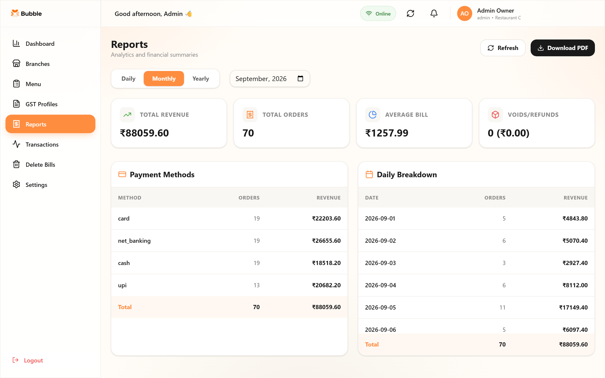
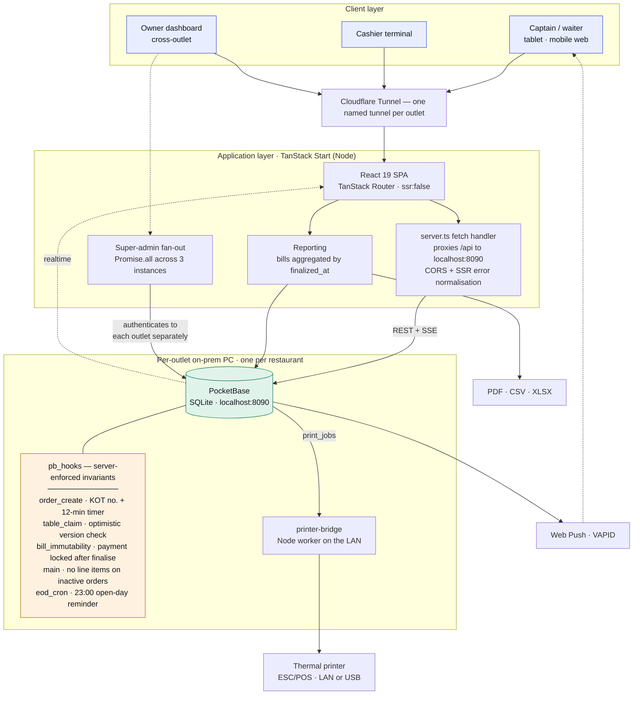
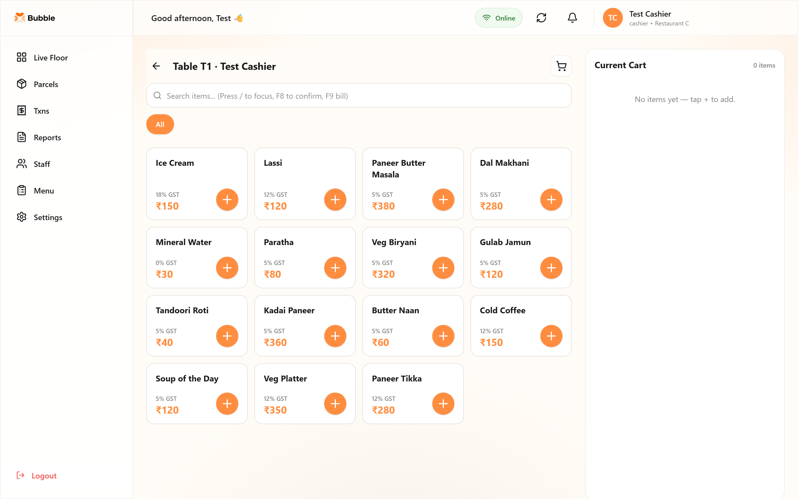
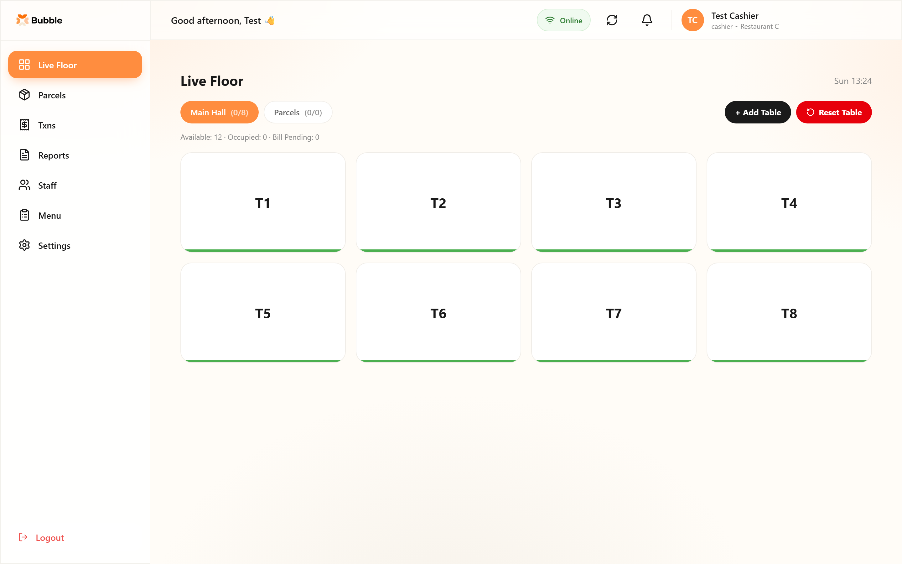
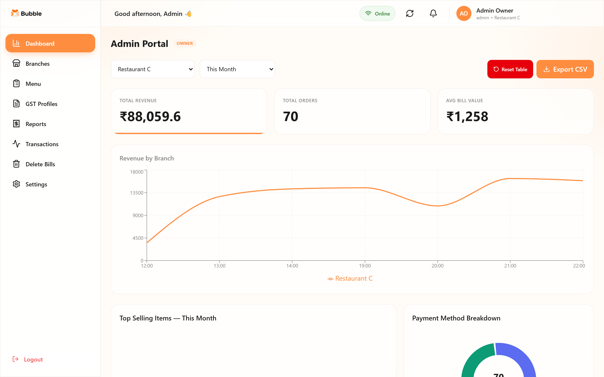
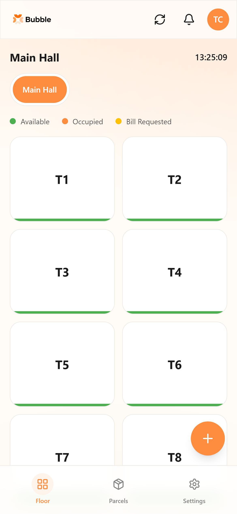

# Multi-Restaurant POS & Management Platform

> Production system running across three restaurants under one owner.
> Built and deployed solo under contract. **Application source is private client
> property — this repository documents the architecture, interface and engineering
> decisions, plus two extracted utilities that are my own work.**



---

## The problem

Three restaurants under one owner, each taking orders on paper and reconciling
revenue by hand at close. GST filing meant re-keying a month of handwritten bills.
The owner could not compare outlets without physically visiting each one.

The hard constraint was connectivity. These are restaurants in a tourist town, and
the internet is not reliable. A POS that stops taking orders when the line drops is
worse than paper — service does not pause while a WAN link recovers.

## What I built

A platform handling order capture, live floor state, billing and statutory
reporting across all three outlets, with per-outlet isolation and a consolidated
owner view.

**My role:** sole engineer. Requirements with a non-technical owner, data modelling,
build, on-site deployment, and ongoing production support.

**Timeline:** built and deployed over roughly three months, mid-2026.
**Status:** live in production.

---

## Architecture



**The auth boundary is the instance itself.** There is no shared gateway. Each
outlet's PocketBase is its own trust boundary: collection API rules scope reads and
writes to `@request.auth.branch_id`, and the role field (`admin`, `branch_manager`,
`cashier`, `captain`, `waiter`, `super_admin`) gates the rest. The owner view does
not bypass this — it authenticates to each instance separately and merges results
client-side.

---

## Interface

| | |
|---|---|
|  |  |
| Order capture, GST slab per item | Live floor state across sections |
|  |  |
| Consolidated owner view | Captain's mobile view |

*All screenshots are captured against a locally seeded demo database. Every name,
figure and GSTIN shown is invented. No client or customer information appears
anywhere in this repository.*

---

## Technical decisions and trade-offs

**Database-per-tenant, not a shared partitioned schema.**
Each outlet runs its own PocketBase process with its own SQLite file on its own
on-prem PC. The alternative — one cloud database with an `outlet_id` column — would
have made the owner's consolidated view a single query instead of three.

I took the harder reporting path to buy operational independence. A restaurant
whose internet drops keeps taking orders, printing KOTs and closing bills against
its local instance; only the cross-outlet view degrades. With a shared cloud
database, a WAN failure stops service at the till. For a restaurant floor at dinner
rush, that trade is not close.

The cost is real and I own it: the super-admin view authenticates to three
instances and fans out with `Promise.all`, merging client-side. Three round trips,
three failure modes, and no way to express a cross-outlet query in SQL. If one
outlet is unreachable the view degrades to partial rather than failing — but the
aggregation logic is mine to maintain rather than the database's.

**Business invariants enforced in the database, not the client.**
The interesting concurrency problem here is two captains claiming the same table at
the same moment. That is not solvable in React. `table_claim.pb.js` runs a version
check inside PocketBase on every status transition:

```js
// pb_hooks/table_claim.pb.js
onRecordValidate((e) => {
  const record = e.record;
  if (record.isNew()) return;

  const oldRecord = record.original();
  if (record.getString("status") === "occupied" && oldRecord.getString("status") === "available") {
    const submitted = record.getInt("version");
    const current = oldRecord.getInt("version");
    if (submitted !== current) {
      throw new BadRequestError(
        "Table was just claimed by another captain. Please refresh.",
        { code: "TABLE_VERSION_CONFLICT" }
      );
    }
    record.set("version", current + 1);
  }
}, "tables");
```

Optimistic concurrency control. The guard is narrow on purpose — it only fires on
the `available → occupied` transition, the one moment two captains can collide, so
every other status change stays a cheap unconditional write. The version increments
inside the same validation hook that checked it, which is what makes the
read-compare-write atomic rather than a race of its own. The loser gets a typed
error code the UI can act on, instead of two captains silently building orders on
one table.

The same reasoning put KOT sequence assignment server-side
(`order_create.pb.js`) — clients must never pick their own sequence numbers — and
locked the payment method after a bill is finalised (`bill_immutability.pb.js`).

**Prices and GST slabs are snapshotted onto the order line.**
A bill is computed from `price_snapshot` and `gst_slab_snapshot` captured when the
item was ordered, never from the live menu record. Menu prices change; a bill
reprinted in October must reproduce exactly what was issued in April, and GST
filings are audited against the figures as issued. Reading the current menu row
would silently rewrite history. See [`code/gst-billing.ts`](code/gst-billing.ts).

**Rounding per line, not on the total.**
Two lines of ₹33.333 round to ₹66.67 at the end but ₹66.66 per line. The receipt
shows per-line amounts, so the totals must equal the sum of the numbers the
customer can actually see — otherwise the bill fails to add up under inspection.

**A separate on-prem worker for printing.**
Thermal printers speak ESC/POS over USB or raw TCP. Neither is reachable from a web
runtime, so `printer-bridge` is a small Node worker on the restaurant LAN that turns
`print_jobs` rows into paper. Making printing a queue rather than a synchronous call
also means a jammed or offline printer doesn't block the cashier from closing a bill.

**PocketBase over a hand-rolled API.**
It gave me auth, REST, realtime SSE, file storage and an admin UI on day one, as a
single Go binary a non-technical owner can restart from a `.bat` file. That
mattered more than API elegance for a solo build under contract.

What it cost me: PocketBase's filter syntax is not SQL, so anything analytical gets
pulled into JS and reduced in memory. The reporting path fetches all bills in a
date window and aggregates client-side — fine at current volume, and the first
thing that will break as it grows.

### What I'd do differently

**Secrets never belonged in source.** `pushLogic.server.ts` hardcoded the VAPID
private key as a string literal on line 17, and selected per-outlet superuser
credentials with an `if (pbUrl.includes("8091"))` chain. The public key was read
from env, three lines above, which makes the omission harder to defend, not easier.
It should all have been env from the start.

**The `activeBranchId` fallback is a real bug.** `store.tsx` resolves
`user?.branch_id || getActiveBranchSlug()` — a record ID or, failing that, a *slug*.
For an admin with no `branch_id` the filter becomes `branch_id = "restaurant-c"`,
which matches nothing, and the owner's own reports render empty. Two identifiers
with the same shape and different meanings, which is exactly the kind of thing a
type would have caught.

**Aggregate-on-read will not scale.** Reporting reads every bill in the window and
reduces in JS. At three outlets and a few hundred bills a month that is invisible.
At thirty it is not. A nightly rollup into a daily-totals collection is the obvious
fix and I would build it before adding a fourth outlet.

---

## Stack

**Frontend** React 19 · TypeScript · TanStack Router / Start / Query · Tailwind 4 · Radix UI
**Backend** PocketBase (Go binary) · JS hooks (`pb_hooks`) · Node worker for printing
**Data** SQLite, one instance per outlet
**Realtime** PocketBase SSE subscriptions · Web Push (VAPID)
**Reporting** Recharts · `xlsx` · `react-to-print` for PDF and thermal output
**Infrastructure** On-prem per outlet · Cloudflare Tunnel per site

---

## What changed for the business

**The end-of-day count stopped being a reconstruction.**
Revenue used to be totalled by hand from a spike of paper bills after close. Every
bill is now computed, numbered and stored as it is raised, so the day's total is a
fact the system already knows rather than something a tired cashier adds up at
midnight. The 23:00 cron nudges anyone who left the day open.

**GST filing stopped being a re-keying exercise.**
Tax was previously recalculated at filing time from handwritten bills — slow, and
wrong in the ways arithmetic done twice is always wrong. CGST and SGST are now split
per line at the moment of ordering, against the slab that item carried that day, and
the invoice the customer receives is already the tax record. Filing became a matter
of reading back figures that were correct when issued.

**Orders stopped getting lost between the floor and the kitchen.**
Paper chits go missing, get written twice, or arrive out of order. The kitchen ticket
number is assigned by the server, so it can't be duplicated or skipped, and the same
order is visible to the captain who took it and the cashier who bills it at the same
instant.

**Two waiters can no longer seat the same table.**
On a busy floor this used to mean one order overwriting another, discovered at
billing. A version check inside the database rejects the second claim outright and
tells that captain to refresh — the conflict surfaces in the second it happens, not
twenty minutes later at the till.

**A finalised bill stopped being editable.**
Once a bill is closed, its payment method cannot be changed and items cannot be
added to the order behind it. Both rules are enforced in the database rather than
the interface, so they hold regardless of which screen or device is used.

**The owner stopped driving between outlets to find out how they were doing.**
Each restaurant's figures and the consolidated view across all three are available
from one screen, with the same numbers the tills produced.

**And a dropped internet connection stopped being a service outage.**
Each outlet holds its own database on-site. If the line goes down the restaurant
keeps taking orders, printing tickets and closing bills; only the owner's
cross-outlet view waits for the connection to come back.

---

## About the GST claim

Worth stating precisely, because it is easy to overclaim. The system **computes and
stores GST per bill** (`cgst_total` / `sgst_total`, split from the slab captured at
order time) and prints a **GSTIN-bearing tax invoice**. The period report and PDF
export summarise revenue under the registered GSTIN.

It does **not** file returns, and the period report does not currently break out
CGST/SGST totals — the reporting code reads a `gst_total` field that does not exist
on the bills collection, so that figure would read zero if it were surfaced. What
the system removed was the re-keying of handwritten bills at filing time, not the
filing itself.

---

## What's in this repository

```
code/gst-billing.ts        GST calculation engine, extracted verbatim
code/useRealtimeTables.ts  PocketBase realtime subscription hook
docs/screenshots/          9 captures against seeded demo data
```

Both extracts are my own work and carry no client data. They are included because
they are the parts worth reading; the rest of the application is the client's.

---

## A note on the source

This system is in production and owned by the client, so this repository does not
contain the application. Everything here — architecture, interface, decisions — is
my own work, and I'm happy to walk through any part of the implementation.

**Kuldeep Patra** · [LinkedIn](https://www.linkedin.com/in/kuldeeppatra) · kuldeeppatra8@gmail.com
